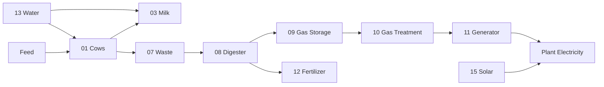
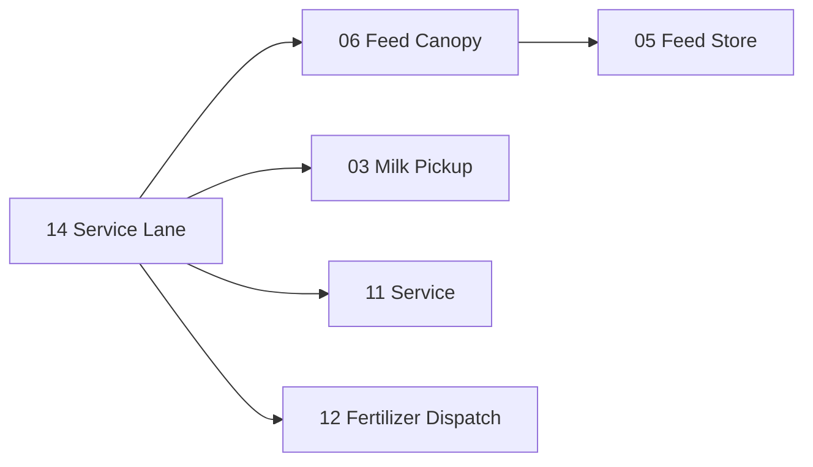
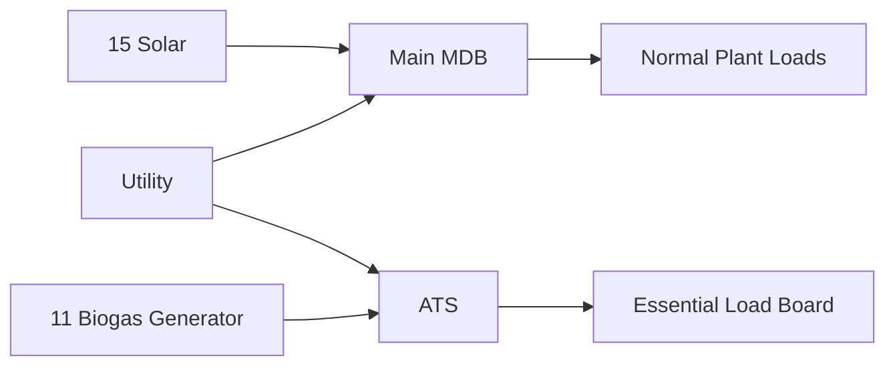
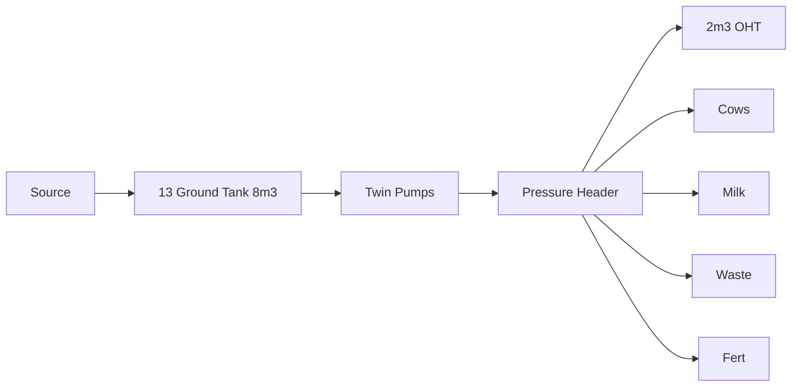

# Master Diagrams

## Whole value chain


## Logistics


## Clean-to-dirty progression
```text
FRONT
Public / clean / feed
        ↓
Dairy / milk
        ↓
Waste / slurry
        ↓
Digester
        ↓
Gas / power / fertilizer
REAR
```

## Power


## Water


## Rule
Detailed local diagrams remain in the relevant section.
