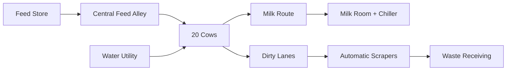
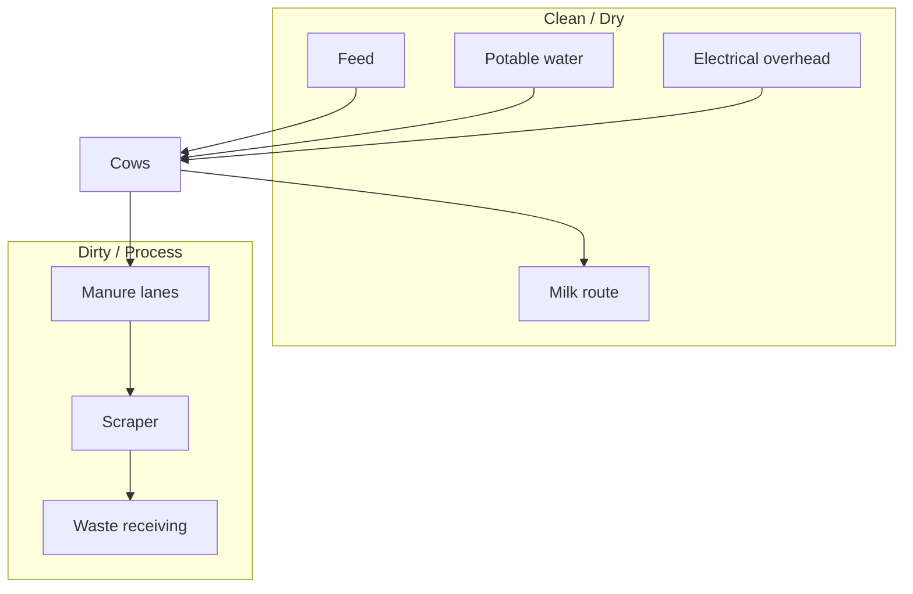

# Cow Shed — Diagram Pack

## 1. Width section diagram

```text
SOUTH                                                                  NORTH
┌───────┬────────────┬───────┬──────────────┬───────┬────────────┬───────┐
│ 3.0'  │   5.5'     │ 1.5'  │     6.0'     │ 1.5'  │    5.5'    │ 3.0'  │
│dirty/ │ south cow  │manger │ central feed │manger │ north cow  │dirty/ │
│service│ platform   │       │    alley     │       │ platform   │service│
└───────┴────────────┴───────┴──────────────┴───────┴────────────┴───────┘
Total = 26 ft
```

## 2. Length diagram

```text
WEST                                                               EAST
┌────────┬──────────────────────────────────────────────────┬────────┐
│ 4 ft   │ 10 stalls × 4 ft planning module = 40 ft       │ 4 ft   │
│ cross  │                                                  │ cross  │
│ zone   │                                                  │ zone   │
└────────┴──────────────────────────────────────────────────┴────────┘
Total = 48 ft
```

## 3. Plan concept

```text
Y=26  ┌──────────────────────────────────────────────────────────────┐
      │ North dirty/service + scraper lane                           │
Y=23  ├──────────────────────────────────────────────────────────────┤
      │ North cow row: 10 stalls                                     │
Y=17.5├──────────────────────────────────────────────────────────────┤
      │ North manger                                                  │
Y=16  ├──────────────────────────────────────────────────────────────┤
      │                                                              │
      │             CENTRAL FEED ALLEY — 6 ft                        │
      │                                                              │
Y=10  ├──────────────────────────────────────────────────────────────┤
      │ South manger                                                  │
Y=8.5 ├──────────────────────────────────────────────────────────────┤
      │ South cow row: 10 stalls                                     │
Y=3   ├──────────────────────────────────────────────────────────────┤
      │ South dirty/service + scraper lane                           │
Y=0   └──────────────────────────────────────────────────────────────┘
       X=0       X=4                         X=44             X=48
```

## 4. Roof cross-section

```text
                     Ridge ≈ 17 ft
                          /\
                         /  \
                        /    \
                       /      \
Eave ≈ 12 ft ---------/        \--------- Eave ≈ 12 ft
                     <---26 ft--->
Concept slope ≈ 21°
```

## 5. Material flow



## 6. Utility separation



## 7. Prohibited gas route

```text
BIOGAS PIPE THROUGH COW SHED = NOT ALLOWED IN THIS DESIGN

Digester / gas storage / treatment / generator stay in dedicated process sections.
```

## 8. Image context diagram

When a wider camera is used:

```text
           utility / waste direction
                    ↑
            [waste receiving]
                    ↑
[cow yard] ← [ COW SHED ] → [feed / service side]
                    ↓
          [milk / clean front]
```

This diagram is qualitative; exact global site coordinates are not yet defined in this section.
