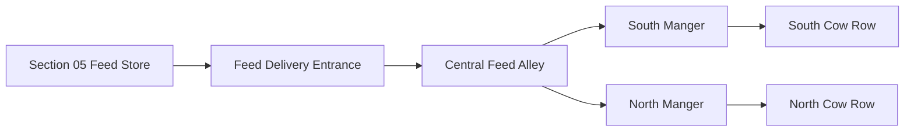
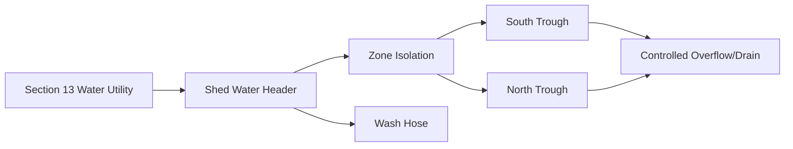
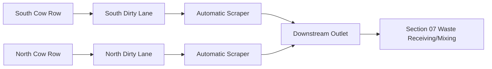
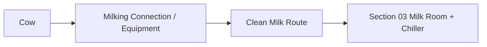

# Cow Shed — Working Process and Daily Operation

## 1. Process overview

Section 01 has five simultaneous functions:
1. house cows
2. receive feed
3. supply water
4. support milking access
5. continuously move manure toward the waste system

The shed should operate as a directional process, not as a storage room.

---

## 2. Feed process

Operating rule:
- feed enters the clean/dry central route
- feed equipment never drives through manure lane
- rejected/spilled feed is cleaned before it becomes manure contamination

---

## 3. Water process

---

## 4. Manure process

The manure route is physically outside the feed alley.

---

## 5. Milk process

Milk should leave the animal zone on the shortest clean route.

The shed should not store milk.

---

## 6. Daily operating sequence

### Before first milking
- inspect cows
- verify water supply
- check scraper lane for obstruction
- verify fans/ventilation
- inspect floor for standing water
- confirm milking path is clean

### Feeding period
- bring ration through central alley
- inspect feed intake
- remove contaminated feed
- keep dirty lanes clear

### Scraper cycle
Automatic control may run multiple cycles/day.

Before/after a scraper cycle:
- check no cow/person/equipment blocks moving mechanism
- confirm end-position
- confirm waste leaves to Section 07
- alarm on overload or jam

### Milking
- use clean milking equipment
- prevent hose/cable contact with manure
- move milk toward Section 03
- clean equipment using approved procedure

### Washdown
- remove solids first where practical
- use controlled water volume
- keep stormwater separate
- prevent chemical discharge to digester without review

### Evening checks
- water
- fans
- lights
- scraper
- gates/rails
- roof leaks
- animal health
- CCTV/sensors

---

## 7. Abnormal operating conditions

### Water failure
- alarm/notify
- switch to emergency stored water
- prioritize drinking over washing

### Scraper jam
- stop motor
- isolate power
- prevent additional wash water/manure loading
- clear under lockout procedure

### Electrical failure
- ensure animal access/ventilation remains safe
- use emergency power strategy if heat/fans require

### Heavy rain
- verify gutters/downpipes
- prevent clean rainwater from entering manure sump

### Heat event
- maximize natural openings
- run circulation fans
- check water availability
- follow livestock heat-stress procedure

---

## 8. Information generated by this section

Daily logs should capture:
- cow count
- water meter
- scraper cycles
- scraper faults
- temperature/humidity
- fan runtime
- section kWh
- manure-system faults
- maintenance actions

These become the basis for future optimization.
