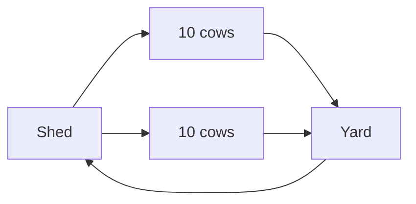
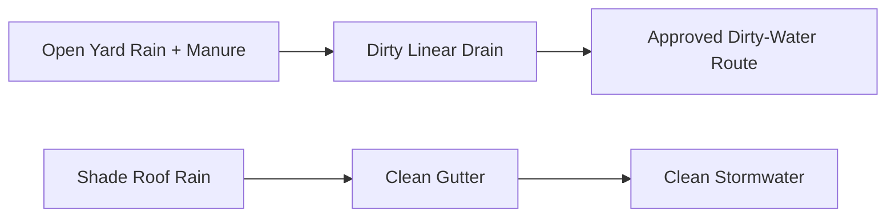

# Cow Yard — Diagram Pack

## Plan
```text
NORTH
┌──────────────────────────── 28 ft ─────────────────────────────┐
│      SHADED 12×18      │      OPEN 12×18       │ SERVICE 4×18 │
│                        │                        │ trough       │
│   up to 10 cows total across active 24×18 ft   │ dirty drain │
│                        │                        │ hose         │
└──────────── cattle gate / shed connection ────────────────────┘
SOUTH
```

## Area
```
216 + 216 + 72 = 504 ft²
```

## Rotation


## Drainage


## Utilities
```text
CYAN       water → trough + wash hose
BROWN      paved floor → dirty drain
LIGHT BLUE canopy roof → clean stormwater
DARK BLUE  lighting/CCTV
GREEN GAS  NONE
```
