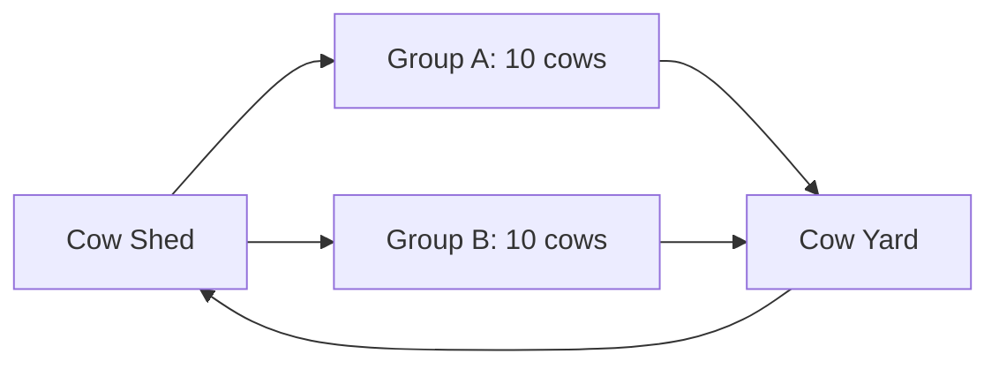

# Cow Yard — Operating Process

## Rotation
The yard operates in two groups of 10 cows.

## Normal cycle
1. inspect yard and gate
2. check trough
3. verify floor is not slippery
4. move Group A into yard
5. allow planned exercise/holding period
6. return Group A to shed
7. scrape/remove solids if needed
8. repeat for Group B
9. wash only as necessary

## Water
Provide drinking water continuously while cows are in yard.

## Manure
Collect solids frequently. Dirty water follows the approved dirty-runoff route.

## Rain
During heavy rain:
- keep clean canopy runoff separate
- monitor dirty drain capacity
- do not overload Section 07/digester with stormwater

## Heat
In hot conditions:
- prioritize shaded half
- reduce holding time if heat stress appears
- confirm drinking water
- use yard only when animal-comfort conditions are acceptable

## Abnormal conditions
Gate failure → stop animal movement.
Blocked drain → stop washdown, clear safely.
Water failure → return cows to shed water source.
Lightning/severe storm → return cows to protected shed.

## Data log
Record:
- group/session time
- water use
- cleaning/wash events
- drain blockage
- gate faults
- injuries/slips
