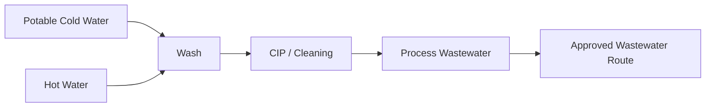

# Milk Room + Chiller — Diagram Pack

## Plan
```text
NORTH — CLEAN MILKING / SHED SIDE
┌──────────────┬────────────────┬───────────┐
│ RECEIVE/TEST │                │ CLEAN     │
│ 6×6          │   CHILLER      │ INGRESS   │
├──────────────┤   7×14         │ 5×6       │
│ WASH / CIP   │                ├───────────┤
│ 6×8          │                │ DISPATCH  │
│              │                │ 5×8       │
└──────────────┴────────────────┴──── DOOR ─┘
SOUTH — SERVICE LANE / MILK TRUCK
```

## Milk flow


## Water/CIP


## Power priority
```text
CRITICAL: chiller → controls → essential pump → lights/ventilation
NON-CRITICAL ON BACKUP: hot-water heater → optional equipment
```

## Utility rule
```text
BLUE milk
CYAN cold water
RED hot water
BROWN wastewater
PURPLE refrigeration
DARK BLUE electrical/data
GREEN GAS = NONE
```
