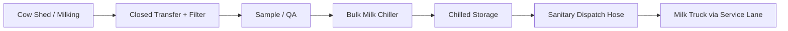

# Milk Room + Chiller — Process and Cold Chain

## Cold-chain target
FAO guidance emphasizes rapid cooling to around 4°C to preserve milk quality. This project adopts:
- target chilled temperature: ~4°C
- cool as soon as practical after milking
- maintain chilled condition until pickup

Reference:
https://www.fao.org/dairy-production-products/processing/milk-preservation/en

## Normal flow

## Two milkings/day
Planning:
- ~70 L per milking
- first batch enters chiller and cools
- second batch is added only according to chiller/vendor procedure
- tank agitator operates as specified

## Pickup
Preferred daily pickup.
Alternate-day collection is possible only when:
- tank capacity is sufficient
- cooling performance is verified
- receiving buyer accepts the storage regime
- applicable food-safety requirements are met

## QA checks
At each milking/pickup:
- volume
- temperature
- appearance/odor
- basic density/lactometer where used
- contamination/antibiotic testing where required by buyer
- tank cleanliness

## CIP / washing
After transfer:
1. drain residual milk
2. pre-rinse
3. hot detergent wash per chemical/equipment instructions
4. intermediate rinse
5. sanitize
6. drain/dry
7. record cycle

Chemical concentrations and temperatures follow equipment/chemical supplier instructions.

## Power failure
- alarm immediately
- preserve tank closed
- start critical backup
- do not run 5 kW water heater on generator backup
- monitor milk temperature
- if cold chain is compromised, segregate milk and follow buyer/food-safety decision

## Chiller failure
- stop adding warm milk if tank cannot cool
- notify collection buyer
- transfer to approved backup cooling only
- record time/temperature

## Wastewater abnormality
Chemical spill or concentrated CIP chemical:
- isolate
- do not send to digester
- collect/dispose under approved procedure
