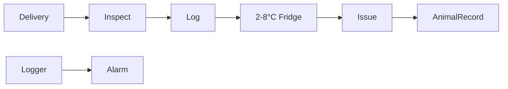
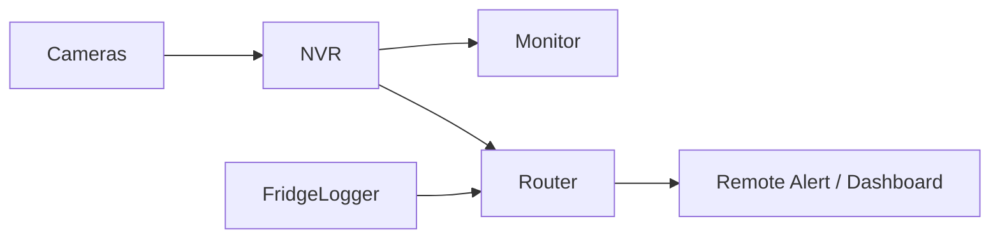

# Office + Vet + Biosecurity — Diagram Pack

## Plan
```text
WEST / PUBLIC ENTRY                                      EAST / FARM
┌────────────┬───────────────┬────────────────────────────┐
│            │               │ MEDICINE + VACCINE 6×4   │
│ BIOSECURITY│ OFFICE /      ├────────────────────────────┤
│ 4×12       │ MONITOR 5×12  │ VET / AI 6×8             │
│            │               │ sink • bench • LN2 tank  │
└── PUBLIC ──┴───────────────┴──────────── FARM DOOR ────┘
```

## Biosecurity flow


## Medicine cold chain


## Data/security


## Critical power
```text
Plant supply
   ↓
Critical circuit
   ├── vaccine fridge
   ├── temperature logger
   ├── NVR/router
   └── emergency light
        ↑
     local UPS bridge
```

## Utility colors
CYAN water
BROWN sanitary drainage
DARK BLUE power/data
PURPLE vaccine cold-chain
MAGENTA CCTV/security
GREEN GAS = NONE
