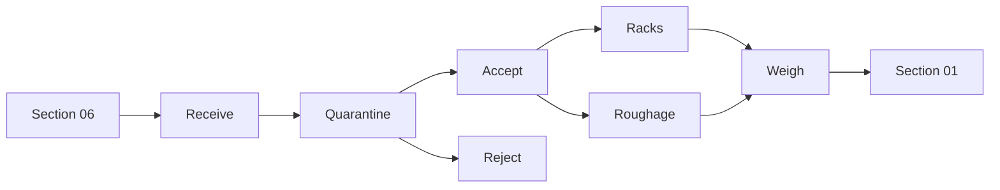

# Feed Store — Diagram Pack

## Plan
```text
NORTH / COW-SHED DISPATCH
┌───────────────┬────────┬────────┬────────┐
│ WEIGH / MIX   │MINERAL │ CLEAN  │DISPATCH│  Y=14–18
│ 8×4           │ 4×4    │ 4×4    │ 4×4   │
├───────────────┼────────┼─────────────────┤
│ ROUGHAGE      │ 4 ft   │ CONCENTRATE     │
│ 8×10          │ AISLE  │ RACKS 8×10      │  Y=4–14
│               │        │                 │
├──────────────────────────────────────────┤
│ RECEIVING / QUARANTINE 20×4              │  Y=0–4
└──────── SOUTH / SECTION 06 ───────────────┘
```

## Flow


## Dryness hierarchy
```text
ROOF/DOORS SEALED
      ↓
RAISED FLOOR + DPM
      ↓
VENTILATION
      ↓
PALLETS/RACKS
      ↓
RH + MOISTURE MONITORING
      ↓
DEHUMIDIFIER IF REQUIRED
```

## Utilities
```text
CYAN    small clean-water point only
DARK BLUE electrical/data
TEAL    ventilation/RH
RED     fire/pest
GREEN GAS = NONE
```
