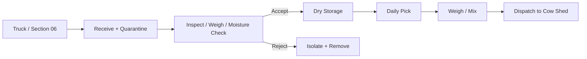

# Feed Store — Operating Process

## Material flow

## 1. Receiving
At every delivery:
- verify supplier
- compare purchase order
- count/weigh bags/bales
- inspect for rain/wetness
- inspect mold/odor
- inspect pests
- record lot/date/price
- quarantine questionable material

## 2. Acceptance
Accept only:
- dry
- intact
- correctly labeled
- within quality/expiry requirements
- free of obvious mold/contamination

## 3. Storage
Concentrates:
- rack/pallet
- labeled by lot
- FIFO/FEFO
- no direct floor contact

Roughage:
- palletized
- ventilated stack
- no wet bales
- monitor heat/mold/odor

Minerals:
- sealed
- controlled-access cabinet/bin
- no chemicals stored together

## 4. Daily issue
1. read ration sheet from farm manager/nutrition plan
2. pick oldest approved stock
3. weigh required quantity
4. record inventory deduction
5. mix only approved ingredients
6. dispatch directly to cow shed

## 5. Spill
- stop traffic
- recover clean material if allowed
- contaminated feed goes to waste, not cows
- sweep/vacuum floor
- investigate torn bag/pallet issue

## 6. Mold/wet feed
- isolate immediately
- label DO NOT FEED
- record quantity
- remove from store
- investigate roof/humidity/source

## 7. Pest event
- quarantine affected zone
- remove contaminated feed
- clean
- reset traps/control measures
- document root cause

## 8. Monsoon
- inspect thresholds/roof daily
- monitor RH
- use dehumidifier when required
- shorten storage duration if feed condition deteriorates

## 9. Inventory data
Track:
- opening stock
- deliveries
- supplier
- batch
- price/kg
- issue quantity
- closing stock
- loss/spoilage
- days on hand
