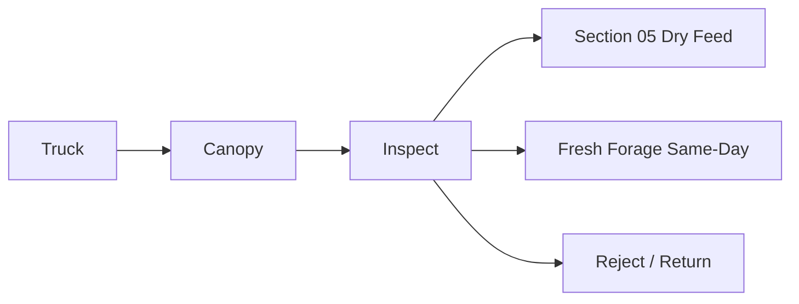
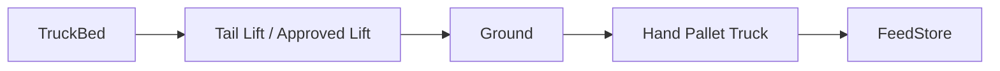
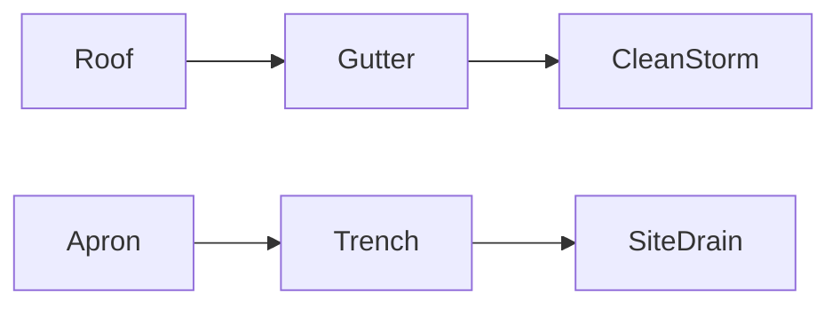

# Feed Unloading Canopy — Diagram Pack

## Plan with service lane
```text
NORTH
[ SECTION 05 FEED STORE / 8-ft RECEIVING DOOR ]
┌────4 ft────┬──────10 ft──────┬────4 ft────┐
│ FRESH      │ MAIN BAG/PALLET │ INSPECTION │  10 ft
│ FORAGE     │ UNLOADING       │ + SAFETY   │  CANOPY
└────────────┴──────────────────┴────────────┘  Y=0
        ← 4 ft worker/unloading gap →
┌──────────────── TRUCK ~8 ft ────────────────┐
└─────────────────────────────────────────────┘
        ← ~2 ft outer clearance →
SERVICE LANE TOTAL WIDTH = 14 ft
SOUTH
```

## Roof section
```text
Feed-store side: Z≈14 ft
      ┌────────────
      │\
      │ \
      │  \  10 ft projection
      │   \
      │    └──── Z≈12 ft + gutter
      └──────────── apron → trench drain
```

## Feed flow


## Pallet flow


## Drainage


## Utilities
```text
LIGHT BLUE = roof stormwater
BROWN      = apron drainage
DARK BLUE  = electrical/CCTV
AMBER      = dry feed flow
GREEN      = fresh forage
GAS        = NONE
```
