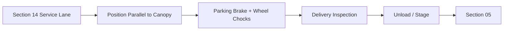

# Feed Unloading Canopy — Operating Process

## 1. Truck arrival


## 2. Before unloading
- confirm canopy clear
- confirm feed-store door clear
- worker high-vis/PPE
- driver sets brake
- place wheel chocks
- engine off unless vehicle unloading equipment requires power
- verify no other vehicle conflict in lane

## 3. Bagged feed
- inspect bag condition
- unload to trolley/pallet
- weigh/count as required
- move immediately to Section 05 receiving/quarantine
- do not build long-term stack under canopy

## 4. Palletized feed
If truck has tail lift:
```
truck bed → tail lift → ground → hand pallet truck → Section 05
```

If no tail lift:
- use approved forklift/stacker/supplier lifting equipment
- do not use steep improvised ramp
- do not drop pallet

## 5. Fresh forage
```
delivery → west staging zone → inspect → same-day feed preparation
```

Maximum planned emergency staging:
```
~600 kg / 2 days
```

Keep on clean tarp/bin/rack rather than directly on wet concrete.

## 6. Damaged/wet feed
- place in marked temporary reject area
- do not move into Section 05 good stock
- photograph/document if supplier claim is needed
- remove promptly

## 7. Rain
- position truck close but maintain safe worker gap
- use canopy cover
- stop if feed becomes wet
- verify trench drain is clear

## 8. Departure
- clear trolley/pallet
- remove chocks
- inspect lane
- close Section 05 door
- release truck only after worker confirms clear zone

## 9. Delivery log
Record:
- supplier
- time
- vehicle
- feed type
- quantity
- lot/batch
- bag/bale condition
- rejected quantity
- price
- receiving worker
