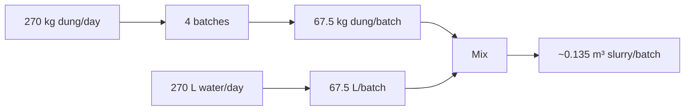

# Waste Receiving + Mixing — Diagram Pack

## Plan
```text
WEST / FROM COW SHED                          EAST / TO DIGESTER
┌──────────────┬──────────────────┬──────────────┐
│ SCREEN/GRIT  │                  │ CONTROL      │
│ + RS-101     │ MT-101 + M-101   │ + ES-101     │ 10 ft
│ + P-101      │ P-102 + METERS   │ PLC/PPE      │
└──────────────┴──────────────────┴──────────────┘
     4 ft              6 ft             4 ft
TOTAL LENGTH = 14 ft
```

## Batch mass flow


## Emergency flow


## Control chain
```text
LEVELS → PLC ← LOAD CELLS
          ↑
WATER FLOW/VALVE
          ↑
MIXER/PUMPS
          ↑
SLURRY FLOW
          ↑
DIGESTER READY
```

## Utility colors
BROWN = manure/slurry
CYAN = water
ORANGE = emergency containment
DARK BLUE = power/data
PURPLE = controls
GREY = vent/odor
