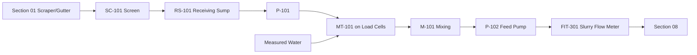

# Waste Receiving + Mixing — Operating Process

## Normal batch

## Batch sequence
1. confirm AUTO mode
2. confirm Section 08 ready
3. confirm RS-101 material available
4. tare/check MT-101 load cells
5. start P-101
6. stop at ~67.5 kg dung target
7. open water valve
8. add ~67.5 L water
9. close water valve
10. start mixer
11. mix 5–10 min planning
12. reconfirm digester permissive
13. start P-102
14. meter ~0.135 m³ slurry
15. stop P-102
16. log batch
17. alarm if residual MT-101 level/mass abnormal

## Four feed windows
Planning windows approximately every 6 hours.

The PLC may delay a window when:
- dung quantity insufficient
- digester high level
- digester maintenance
- pump fault
- flow meter fault
- emergency sump active

## Receiving high level
RS-101 HIGH:
- prioritize batch preparation
- warn operator

RS-101 HIGH-HIGH:
- if ES-101 has capacity, divert/overflow to ES-101
- inhibit unnecessary wash water
- alarm operator

## Emergency sump
ES-101 HIGH:
- urgent alarm
- stop nonessential upstream water
- prepare manual recovery

ES-101 HIGH-HIGH:
- critical alarm
- stop automatic scraper/wash sequence as safely designed
- prevent uncontrolled environmental discharge
- manual intervention required

## Pump fault
- stop associated sequence
- close automatic valves
- preserve containment
- alarm
- switch to maintenance/manual only after isolation

## Flow-meter fault
No blind automatic feed based only on timer unless operator explicitly selects controlled manual fallback.

## Water failure
- hold batch
- do not feed undiluted dung unless digester operator/vendor approves
- alarm

## Digester high level
- P-102 inhibited
- slurry remains in MT-101 or ES-101 within capacity
- upstream receiving continues only while safe containment exists

## Manual mode
Manual mode must still keep hard interlocks for:
- emergency stop
- dry-run protection
- high-high containment
- digester high-high inhibit where physically possible
