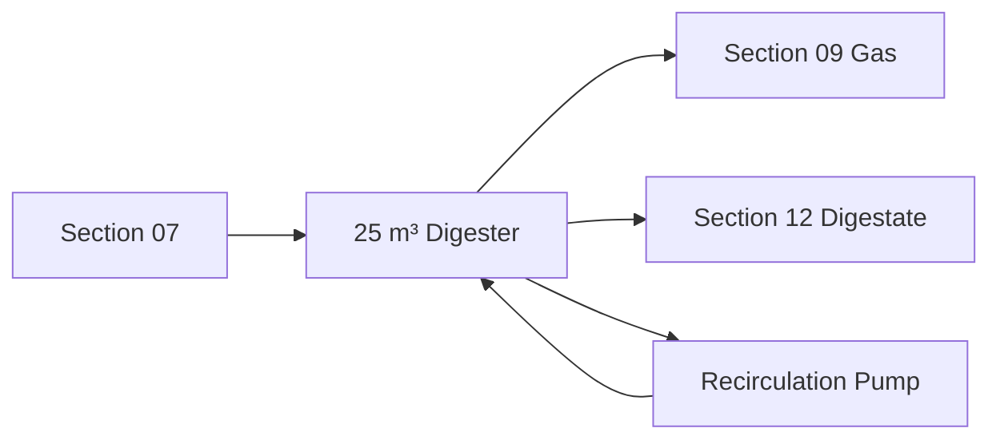

# Biogas Digester — Diagram Pack

## Compound plan
```text
NORTH
┌──────────────────── 20 ft ────────────────────┐
│       GAS / P-V SAFETY / CONDENSATE           │
│                                               │
│ FEED PIT   [  RCC DIGESTER ~10.5 ft OD ] OUT │ 16 ft
│ + RECIRC                                      │
│                                               │
│          SOUTH MAINTENANCE ACCESS             │
└───────────────────────────────────────────────┘
WEST: Section 07                  EAST: Section 12
```

## Vertical section
```text
          gas outlet → Section 09
                 |
       +-------------------+  internal top ≈ +1.06 m
       |  ~5 m³ headspace  |
NLL -> |-------------------|  ≈ +0.25 m
       |                   |
       |   20 m³ slurry    |  depth ≈3.25 m
       |                   |
       +-------------------+  internal bottom ≈ -3.00 m
```

## Hydraulic process


## Volume relationship
```text
Minimum 30-day liquid = 16.2 m³
Selected liquid       = 20.0 m³
Headspace              =  5.0 m³
Total                  = 25.0 m³
```

## Utility colors
BROWN slurry feed
YELLOW-BROWN digestate
GREEN raw biogas
PURPLE recirculation
RED relief/safety
DARK BLUE controls
