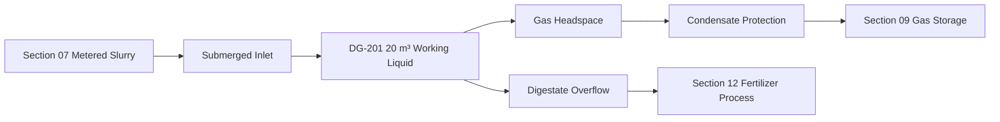

# Biogas Digester — Operating Process

## Normal process


## Feed
Four batches/day:
```
~0.135 m³ each
```

Section 07 feed is accepted only when:
- digester level not high-high
- gas pressure within allowed range
- digestate outlet available
- no maintenance lockout
- no critical gas alarm

## Displacement
Every feed batch displaces roughly equal digestate:
```
~0.135 m³
```

The outlet must remain free-flowing.

## Recirculation
Planning:
- periodic short runs rather than continuous
- schedule based on settling/scum observation
- avoid excessive shear/foaming
- stop on low level, pump fault or maintenance lockout

## Gas
Biogas accumulates in the headspace and continuously moves to Section 09.

If gas-holder route is unavailable:
- pressure rises
- feed is inhibited before unsafe pressure
- P/V safety system remains available
- controlled flare/safe vent philosophy belongs to the gas-system design

## High liquid level
Possible causes:
- outlet blockage
- overfeed
- rain/foreign liquid ingress

Response:
- stop Section 07 feed
- inspect digestate outlet
- maintain gas relief
- do not manually open manway while gas is present

## Low temperature
- log reduced temperature
- avoid abrupt feed increases
- monitor gas output/pH
- evaluate insulation/heating only through formal design change

## pH upset
Low pH trend may indicate acid accumulation/overload.
Actions:
- reduce/hold feed based on process specialist guidance
- review water ratio
- review gas production
- test alkalinity/VFA if available

## Foaming/scum
- stop aggressive recirculation
- investigate feed composition
- verify freeboard
- do not open gas-space manway without full gas-safe procedure

## Digestate blockage
- stop feed
- isolate/clean outlet from external service point
- avoid pressure forcing through blocked line unless designed for it

## Gas pressure abnormal
High/high-high:
- stop feed
- check Section 09/gas line
- activate designed protection

Vacuum/low:
- avoid pulling air into vessel
- verify gas withdrawal and P/V protection
