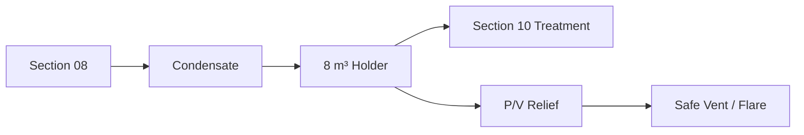
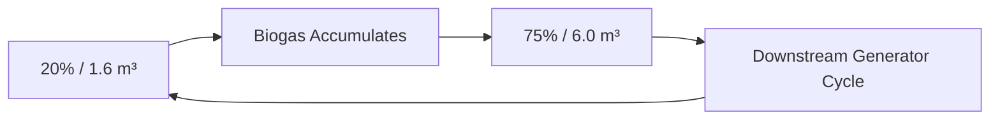

# Gas Storage — Diagram Pack

## Plan
```text
NORTH / SAFE VENT-FLARE DIRECTION
┌──────────────── 12 ft ────────────────┐
│                                       │
│  [  PROTECTIVE FRAME ~7.9×7.9 ft ]   │
│  [     GH-301 8 m³ membrane       ]  │ 10 ft
│                                       │
│         MANIFOLD / CONTROL STRIP      │
└───────────────────────────────────────┘
WEST: Section 08            EAST: Section 10
```

## Inventory
```text
95%  7.6 m³  HIGH-HIGH
90%  7.2 m³  HIGH
75%  6.0 m³  DEMAND ENABLE
30%  2.4 m³  LOW WARNING
20%  1.6 m³  LOW CUTOUT
```

## Gas flow


## Normal cycle


## Utilities
GREEN = raw gas
CYAN/GREY = condensate
RED = relief/flare
PURPLE = volume sensing
DARK BLUE = control/data
YELLOW-GREEN = bonding/earth
