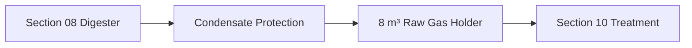

# Gas Storage — Operating Process

## Normal fill

## Storage level behavior
### 0–20%
Low region.
- generator withdrawal inhibited
- maintain minimum membrane shape/vacuum protection
- alarm at configured low level

### 20–75%
Normal accumulation/standby region.

### ≥75%
Downstream generation demand may be enabled when Section 10/11 are ready.

### ≥90%
High warning.
- prioritize downstream use
- review gas-production/consumption mismatch

### ≥95%
High-high.
- inhibit/limit upstream feed if necessary
- command engineered flare/vent pathway according to system logic
- critical alarm if gas cannot be consumed safely

## Withdrawal
Section 10 draws gas.
Holder outlet remains raw gas.
Do not bypass Section 10 to generator.

## Low pressure/vacuum
If pressure approaches vendor low limit:
- stop downstream withdrawal
- verify bag is not being sucked flat
- check outlet booster/regulator logic
- verify P/V protection

## High pressure
- stop causes of blocked downstream flow
- confirm holder level
- use safety relief/flare logic
- stop digester feeding if needed

## Condensate high
- alarm
- isolate/drain condensate safely
- do not allow liquid slug into holder or Section 10

## Membrane leak
- stop ignition sources
- isolate inlet if safe
- stop/limit upstream feed
- evacuate immediate area
- ventilate
- repair only with approved procedure after gas-safe condition

## Downstream unavailable
If Section 10/11 unavailable:
- continue storage until high threshold
- then reduce upstream feed/activate designed excess-gas path
- never allow uncontrolled bag overinflation

## Power failure
Flexible bag does not require power to retain gas.
Critical sensors/alarms should remain on backup supply where practical.
Mechanical P/V safety remains independent.
