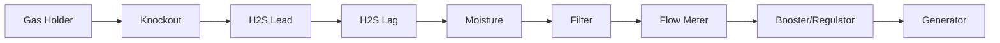

# Gas Treatment — Diagram Pack

## Skid plan
```text
WEST / SECTION 09                              EAST / SECTION 11
┌────2 ft────┬────────4 ft────────┬────────4 ft────────┐
│ KO / INLET │ H₂S A     H₂S B   │ MOISTURE / METER  │
│ SAMPLE     │ LEAD       LAG     │ FILTER / BOOSTER  │ 8 ft
└────────────┴────────────────────┴───────────────────┘
```

## Treatment


## Lead/lag
```text
NORMAL: A lead → B lag
AFTER A SERVICE: B lead → A lag
NO UNTREATED BYPASS
```

## H₂S mass
```text
9.18 m³/day @ 2000 ppm
≈25.6 g H₂S/day raw
≈24.3 g/day removed to 100 ppm
```

## Utilities
DARK GREEN raw gas
LIGHT GREEN treated gas
ORANGE H₂S media
CYAN condensate
RED alarms/safety
DARK BLUE instruments/data
PURPLE electrical/booster
