# Gas Treatment — Operating Process

## Normal treatment

```mermaid
flowchart LR
    S09[Section 09 Holder] --> KO[KO-401 Knockout]
    KO --> A[V-401A Lead H2S]
    A --> B[V-401B Lag H2S]
    B --> MS[MS-401 Moisture Separator]
    MS --> PF[PF-401 Particulate]
    PF --> FM[FIT-401 Gas Meter]
    FM --> BL[B-401 Booster/Regulator]
    BL --> S11[Section 11 Generator]
```

## Startup
1. confirm Section 09 gas available
2. confirm no gas alarm
3. confirm condensate pots drained
4. confirm at least one H₂S vessel available
5. open lead/lag path
6. check outlet H₂S
7. start booster if required
8. stabilize outlet pressure
9. issue treated-gas-ready to Section 11

## Lead/lag changeover
When lead vessel breakthrough trend rises:
- keep lag vessel online
- isolate lead
- depressurize/purge safely
- replace/regenerate media
- leak test
- return renewed vessel as lag
- former lag becomes lead

## Outlet H₂S high
- inhibit generator
- verify sensor/sample
- inspect lead/lag arrangement
- change media as required
- do not open untreated bypass

## Condensate high
- inhibit booster if liquid carryover risk
- drain safely
- inspect upstream gas-line slope
- inspect separator

## Filter differential pressure high
- stop/limit flow
- replace filter element
- inspect media dust/moisture carryover

## Holder low/vacuum risk
- stop booster/generator gas draw
- preserve Section 09 minimum volume
- keep P/V protection active

## Outlet pressure low
- check holder level
- check pressure drop
- check media/filter blockage
- check booster
- do not raise pressure blindly above vendor limits

## Gas detector alarm
- stop booster/generator demand
- close automatic isolation if safe
- alarm/evacuate
- ventilate naturally
- inspect with approved gas detector

## Shutdown
- stop booster
- stop generator demand
- close outlet isolation
- leave P/V safety path intact
- log final pressures/levels
