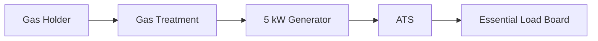
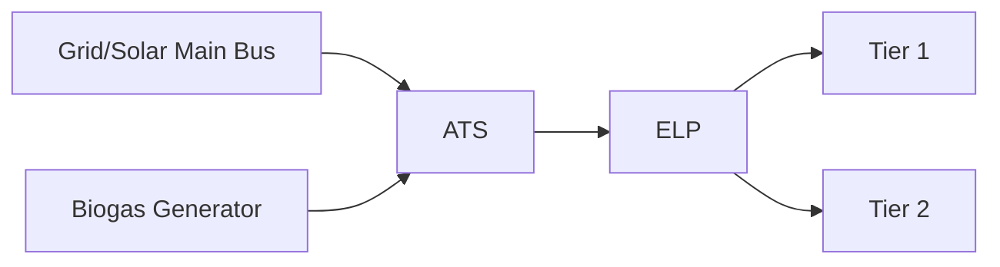

# Generator + Electrical — Diagram Pack

## Room plan
```text
NORTH: HOT-AIR + ENGINE EXHAUST OUT
┌────3 ft────┬──────6 ft──────┬────5 ft────┐
│ GAS/SERVICE│   5 kW GENSET   │ ATS / ELP  │
│            │                 │ PANELS     │ 12 ft
│            │                 │            │
└────── INTAKE LOUVER ──────── DOOR ───────┘
SOUTH
```

## Gas-energy


## Electrical


## Ventilation
```text
LOW SOUTH COOL AIR ---> GENERATOR ---> HIGH NORTH HOT AIR
                                ----> ENGINE EXHAUST SEPARATE PIPE
```

## Colors
treated gas light green
electric dark blue
control purple
cool air cyan
hot air magenta
exhaust orange/red
earth yellow-green
