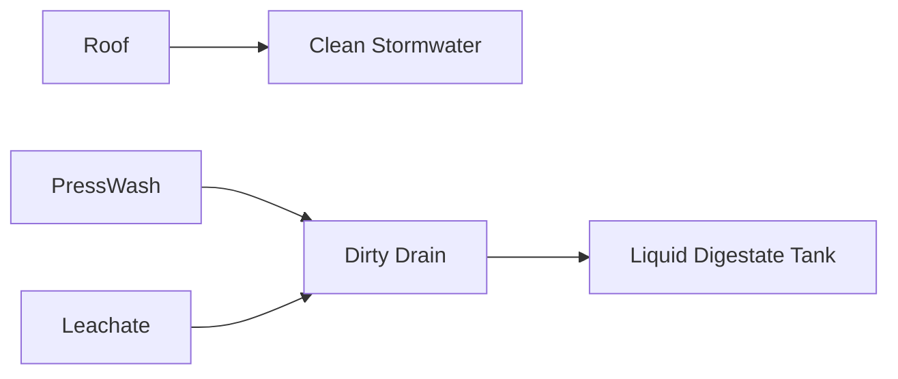

# Fertilizer Processing — Diagram Pack

## Plan
```text
WEST / SECTION 08                                    EAST / SERVICE
┌────6 ft────┬────────8 ft────────┬──4 ft──┬──4 ft──┐
│ BUFFER +   │ CURING / DRYING   │ BAGGING│ LIQUID │
│ SCREW PRESS│ 4 BAYS            │ + BAGS │ TANK   │ 16 ft
└────────────┴────────────────────┴────────┴────────┘
TOTAL LENGTH = 22 ft
```

## Mass flow — base
```text
~540 kg/day digestate
          |
     Screw Press
      /       \
~83.8 kg     ~456 kg
wet cake     liquid
    |
dry/cure
    |
~38.7 kg/day finished @65% TS
≈14.1 t/year
```

## Yield sensitivity
```text
50% capture → ~10.1 t/year
70% capture → ~14.1 t/year
90% capture → ~18.1 t/year
```

## Drainage


## Colors
digestate brown
solid cake dark brown
liquid yellow-brown
leachate orange
clean water cyan
finished product tan
