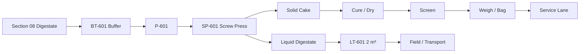

# Fertilizer Processing — Operating Process

## Process


## Daily separator cycle
1. check LT-601 has free capacity
2. check screw press ready
3. mix/settle buffer only as vendor requires
4. start separator
5. start feed pump
6. process ~540 kg digestate
7. collect cake
8. liquid to LT-601
9. flush minimally
10. record run

## Base separator time
```
~1.08 h/day
```

## Cake handling
- move daily cake to assigned curing bay
- date-tag each batch
- spread shallowly
- turn/aerate
- monitor moisture/odor
- prevent rain entry

## Screening/bagging
Only after desired moisture/quality:
- remove oversize debris
- weigh
- bag
- stitch/seal
- palletize
- lot label

## Liquid use
- sample
- calculate agronomic application
- transfer to approved field/container

## Wet season
- rely on roofed drying
- increase airflow
- reduce cake layer depth
- avoid packaging overly wet product

## Press fault
- stop feed pump
- isolate
- keep digestate in BT-601 if capacity
- Section 08 flow managed accordingly

## LT-601 high
- stop separator
- alarm
- remove liquid before restart

## Product out-of-spec
Quarantine.
Do not sell.
