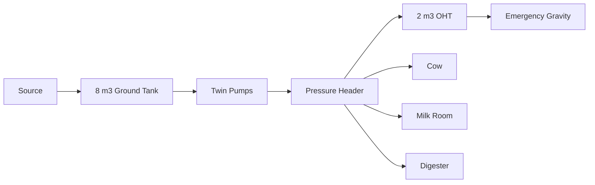

# Water Utility — Diagram Pack

## Plan
```text
NORTH
┌────────8 ft────────┬──4 ft──┐
│ 8 m³ GROUND TANK   │ PUMPS  │
│ BELOW GRADE        │ CTRL   │ 8 ft
└────────────────────┴─────────┘
       total length 12 ft
```

## Storage
```
8 m³ ground + 2 m³ overhead = 10 m³
```

## Flow


## Demand
```
Normal 3.30 m³/day
Design 3.79 m³/day
Hot design 4.25 m³/day
```
