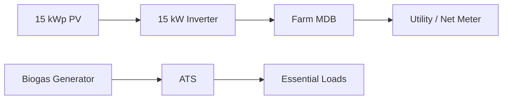

# Rooftop Solar — Diagram Pack

## Roof
```text
PLANE A: [1][2][3][4][5][6][7][8][9][10][11][12]
RIDGE / SERVICE + VENT
PLANE B: [13][14][15][16][17][18][19][20][21][22][23][24]
```

## Strings
```text
12×625 W = 7.5 kWp → MPPT1
12×625 W = 7.5 kWp → MPPT2
TOTAL = 15.0 kWp
```

## Energy
```
15×3.89=58.35 kWh/day
≈21.30 MWh/year
```

## Topology

