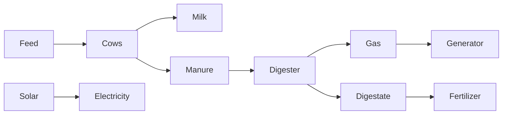

# Master Integration Diagrams

## Plant value chain


## Gas chain
```
07 → 08 → 09 → 10 → 11
```

## Logistics
```
14 → 03 milk
14 → 06/05 feed
14 → 12 fertilizer
14 → service nodes
```

## Utilities
```
13 Water → 01/03/04/07/12
15 Solar → Main MDB
11 Generator → Essential Load Board
```

## Integration rule
Every final master drawing must show section numbers, not only equipment names.
