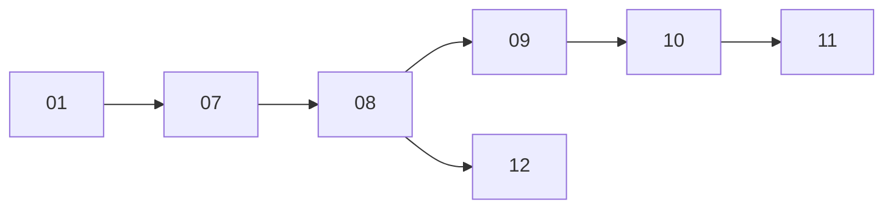

# Master Coordinate Diagrams

## Site bands
```text
X0                 X26        X37       X51          X65
| plant west/core  | clean    | lane-facing plant | LANE |
```

## Longitudinal logic
```text
Y0 FRONT
0–18   office/water/feed/canopy
18–36  cow + clean transfer + milk
37–47  cow + waste
47–63  cow + digester
65–79  yard + gas/treatment/generator
79–95  yard/fertilizer/rear
Y95 REAR
```

## Process


## Lane
```text
X51–65 continuous from Y0 to Y95.
```
