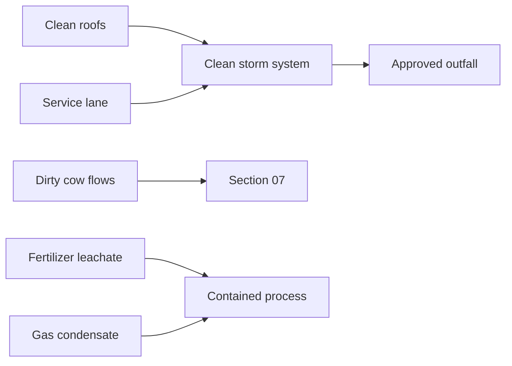

# Section 18 Master Diagrams

## Vertical-design chain
```
SURVEY RL
   ↓
FLOOD / ROAD / OUTFALL
   ↓
PROPOSED SITE GRADING
   ↓
FFL / PROCESS SLABS
   ↓
DRAIN INVERTS
   ↓
FOUNDATION / EXCAVATION
```

## Drainage


## IFC gates
```
Survey → Flood → Drainage → Earthwork → Road → Utilities → Safety → Vendor → QA → IFC
```
