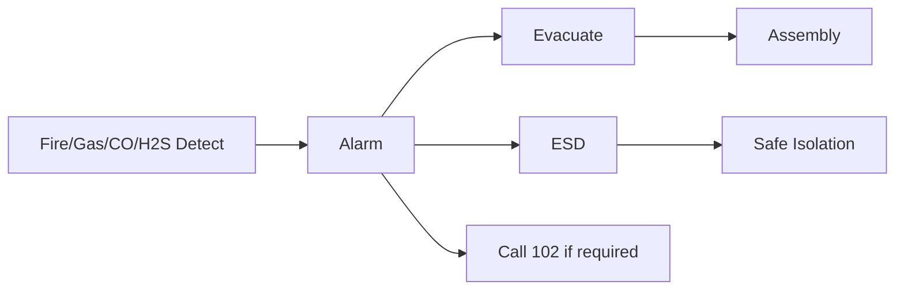

# Section 19 Master Diagrams

## Safety zones
```text
FRONT
[ CLEAN/PUBLIC/FEED/MILK ]
[ LIVESTOCK ]
[ DIRTY BIOLOGICAL ]
[ GAS / ELECTRICAL HAZARD REVIEW ]
[ REAR FERTILIZER/SERVICE ]
EAST: 14-ft emergency/service lane
```

## Emergency chain


## Regulatory
```
BNBC review
   ↓
Fire Safety Plan / e-NOC
   ↓
Inspection / corrections
   ↓
Fire license as applicable
   ↓
Operation / drills / maintenance
```
