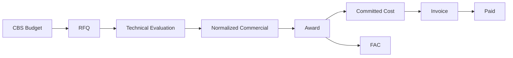

# Procurement / Cost Control Diagrams

## Money flow


## Scope
```
SECTION BUDGETS → MASTER BOQ → PPK PACKAGES → PO/CONTRACTS
```

## Dedup
```
Duplicate candidate → ownership decision → retained quote → exact credit → updated forecast
```
