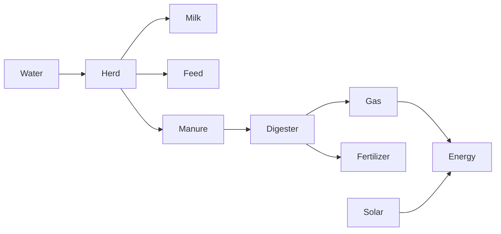

# Operations Master Diagrams

## Daily


## Management loop
```
OPERATE → RECORD → KPI → PM/ACTION → REVIEW → IMPROVE
```

## Alarm
```
P1 immediate
P2 same-shift
P3 maintenance
P4 advisory
```

## Inventory
```
USE → STOCK → ROP → PURCHASE → RECEIVE → FIFO/FEFO
```
