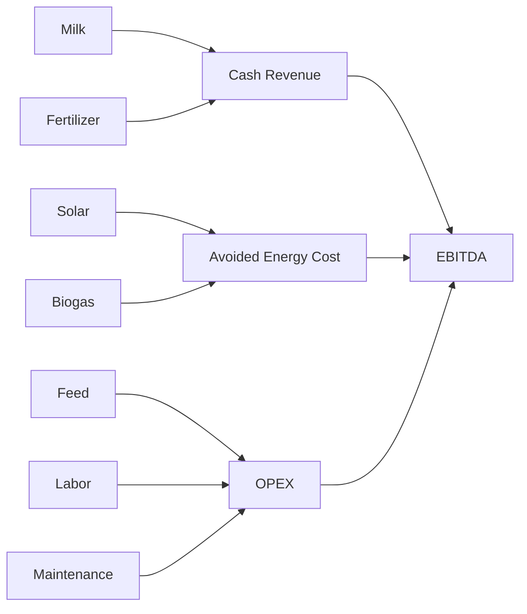

# Financial Master Diagrams

## Value chain


## Investment
```text
Plant CAPEX + Livestock + Working Capital
                  |
             Total Funding
                  |
        Operating Cash Flow
                  |
      Debt Service / Owner Return
```

## FID
```text
Buyer + Herd + Feed + OPEX + CAPEX + Finance
                    |
                   FID
```
